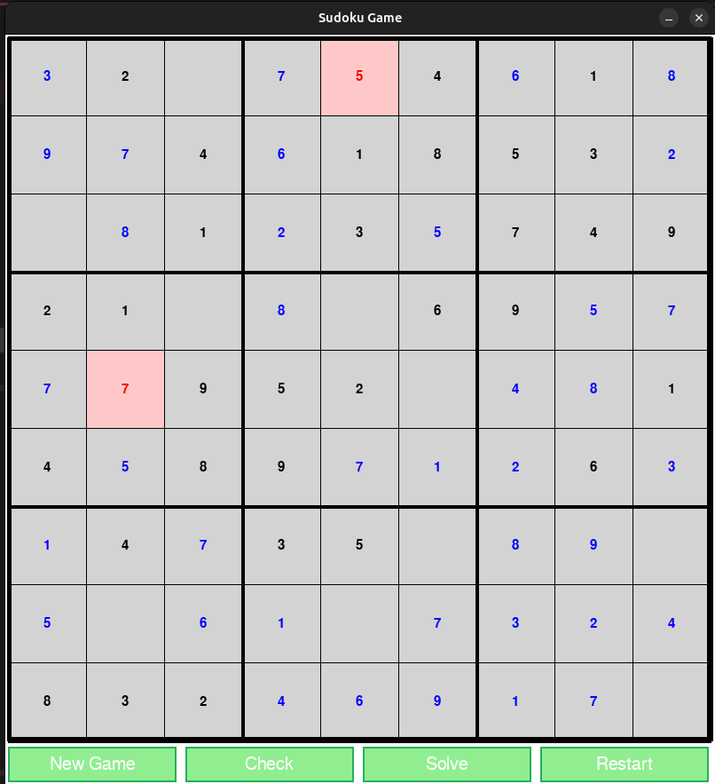
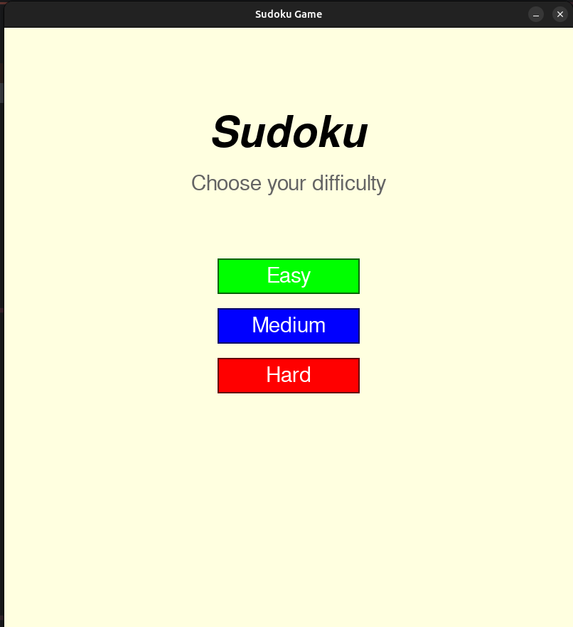
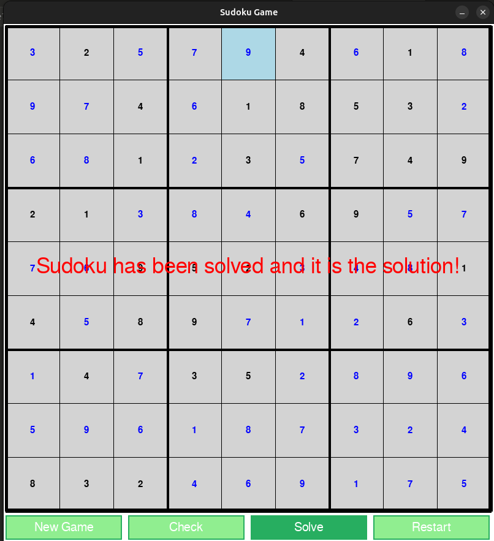

# Sudoku game

---
A Sudoku game built with Python and Pygame. This game is based on a backtracking  algorithm and contains a comprehensive graphical interface with multiple difficulty.




## Installation
1. **Clone repositories**
```bash
git clone https://github.com/jeanbapd/Sudoku-pygame.git
cd Sudoku-pygame
```

3. **Create a virtual environment** (recommended)
```bash 
python3 -m venv venv
source venv/bin/activate
```

2. **Install dependencies**
```bash
pip install -r requirements.txt
```

3. **Play**
```bash
python3 main.py
```
## How to play

### Main menu

- Select your preferred difficulty : **Easy**,**Medium**,**Hard**

### Controls

#### Mouse
- **Click** on any cell to select it
- **Click** on buttons to throw actions

#### Keyboard
- **1-9**: Place a number in the selected cell
- **Delete/0**: Clear the selected cell
- **Arrow keys**: Navigate between cells

### Buttons
- **New Game**: Return to menu to select a new difficulty
- **Check**: Verify if the SUDOKU is correctly solved
- **Solve**: Automatically solve the puzzle using backtracking
- **Restart**: Reset the grid to its initial state

## Algorithm

### Sudoku Generation :
1. **Fill** an empty grid completely using backtracking with randomization
2. **Remove** numbers based on difficulty:
   - Easy: 30 cells removed
   - Medium: 40 cells removed
   - Hard: 50 cells removed

### Backtracking :
The game use a **backtracking algorithm** to generate and solve SUDOKU:
1. **Find** the next empty cell
2. **Try** number 1-9 in that cell
3. **Check** if the number is valid
4. **Recurse** to fill the rest of the grid
5. **Backtrack** if stuck
6. **Return** True when solved, False if impossible

## Project Structure
```
Sudoku-pygame/
|-main.py               #Main game loop
|-src/
| |-button.py
| |-constant.py         # Button class
| |-generator.py        # SUDOKU generation logic
| |-grid.py             # Grid class
| |-menu.py             # Main menu 
| |-solver.py           # Backtracking solver algorithm
|-screenshots/          # Game screenshots 
|-requirements.txt      # Python dependencies
|-.gitignore
|-README.md
```
## Technologies
- **Python 3.10+**
- **Pygame 2.6+**

## Screenshots

### Main Menu


### Gameplay


### Solution


## License
This project is licensed under the MIT License see the [LICENSE](LICENSE) file for details.

## Author

**Dylan JEAN-BAPTISTE**

 - Email: dylan.jeanbaptistepro@gmail.com  
 - GitHub: [@jeanbapd](https://github.com/jeanbapd)

---
*Developed as a portfolio project - January 2026*